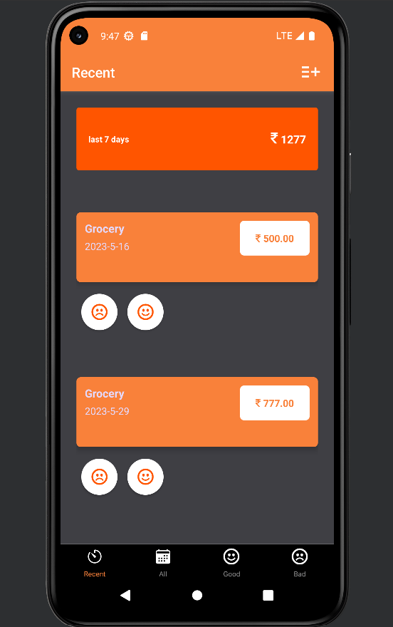

# Expense-Traker-SQL
Expense tracker Android  app made using react Native and expo 
it  uses sqlite to store the data locally in your system .
this project was made as a part of 6th sem miniproject on Mobile application development.

## how to run 
open the project directory in terminal  and run `expo start`
to see the app install `expo go ` app in your android phone and scan the QR code that appear on termial with expo app.
note:your phone and computer should be connected to same wifi.

<!--  -->
